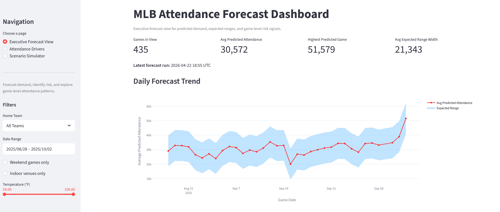
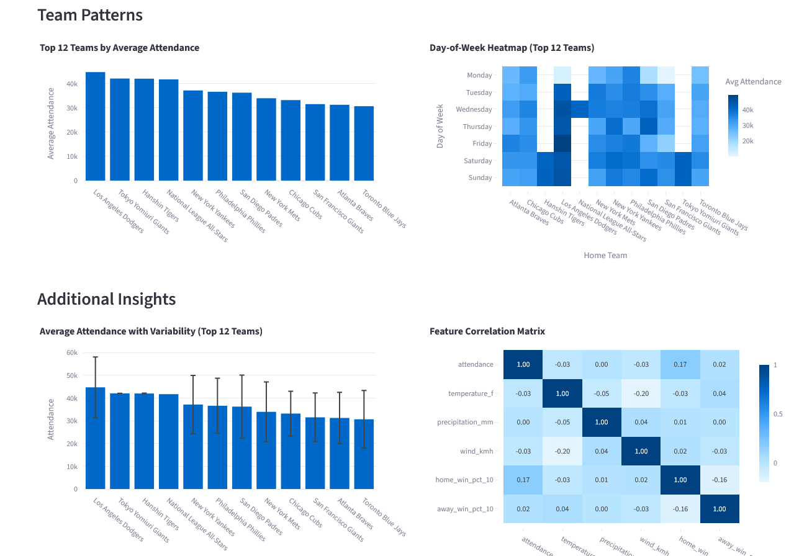
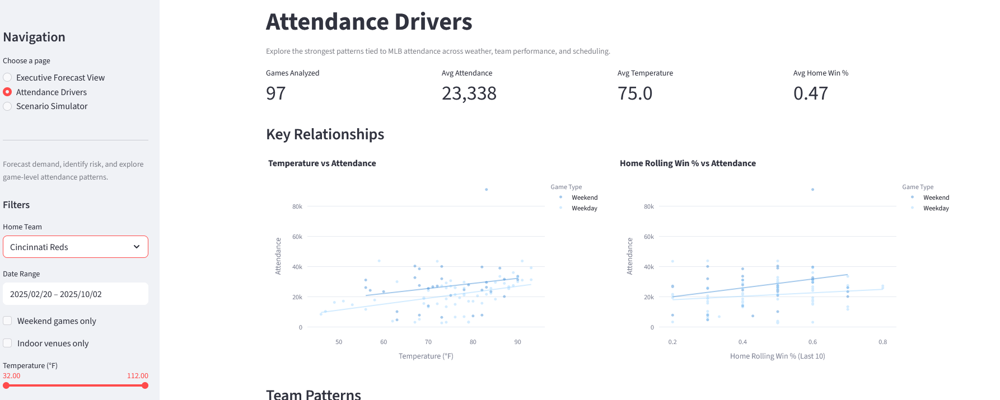
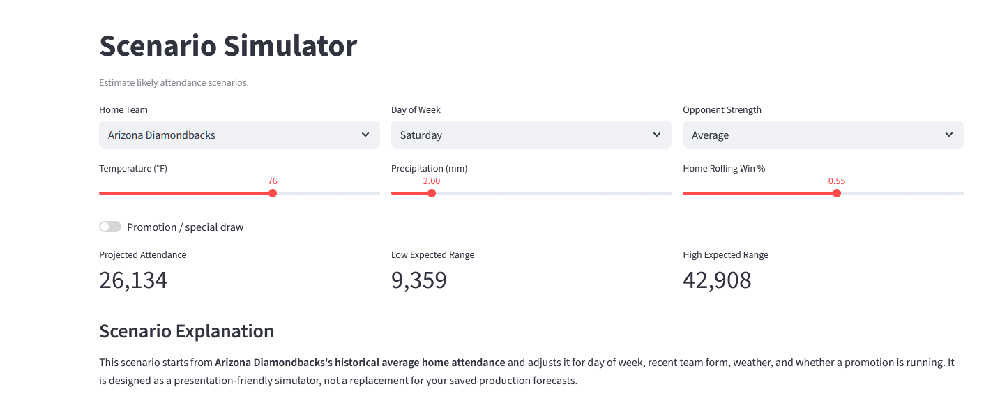

<h1 align="center">MLB Attendance Analysis</h1>

  

<h3 align="center">Forecasting Game-Level Demand</h3>

  <em>
    Parker Munsey 
    University of Montana MSBA 
    Advanced Applied Modeling
  </em>

---

## Project Overview

MLB attendance is influenced by a mix of performance, scheduling, and external factors like weather. However, most organizations rely on historical reporting rather than forward-looking insights.

This project builds an end-to-end data pipeline and dashboard that forecasts MLB game attendance and translates predictions into actionable insights.

---

## Objective

This system moves beyond reactive reporting by enabling:

- Game-level attendance forecasting  
- Prediction intervals (uncertainty)  
- Identification of high-demand and at-risk games  
- Understanding of attendance drivers  
- Data-driven operational decisions  

---

## Why This Project Matters

Teams make decisions on:

- Staffing  
- Concessions  
- Promotions  

This project enables proactive planning instead of reactive guessing.

---

## System Architecture

Ingestion → Database → Features → Model → Forecasts → Dashboard

### Database (PostgreSQL)

Dimension Tables:
- dim_team  
- dim_date  
- dim_venue  

Fact Tables:
- fact_game  
- fact_weather  

Modeling Tables:
- ml_features_attendance  
- fact_attendance_forecast  

---

## Data Sources

- MLB Stats API → games, attendance, teams  
- Open-Meteo API → weather  

---

## Repository Structure

- **[scripts](scripts/)**: Core Python pipeline for data ingestion, feature engineering, modeling, and forecasting.

  - **[load_mlb_games_weather_to_postgres.py](scripts/load_mlb_games_weather_to_postgres.py)**: Pulls MLB game data and weather data from APIs and loads into PostgreSQL.

  - **[build_features.py](scripts/build_features.py)**: Transforms raw data into a model-ready feature table.

  - **[export_features_for_model.py](scripts/export_features_for_model.py)**: Extracts data from PostgreSQL and creates train/validation/test datasets.

  - **[train_model.py](scripts/train_model.py)**: Trains the machine learning model.

  - **[evaluate_model.py](scripts/evaluate_model.py)**: Evaluates model performance and generates predictions with intervals.

  - **[write_forecasts_to_postgres.py](scripts/write_forecasts_to_postgres.py)**: Writes final predictions into the database.

---

- **[dashboard](dashboard/)**: Streamlit application used to visualize forecasts and analyze attendance drivers.

  - **[dashboard_app_mlb.py](dashboard/dashboard_app_mlb.py)**: Main dashboard application.

---

- **[media](media/)**: Contains images and assets used in documentation (including project logo).

---

- **[requirements.txt](requirements.txt)**: Python dependencies required to run the project.

- **[.env.example](.env.example)**: Example environment variables for database connection.

- **[README.md](README.md)**: Project overview, setup instructions, and documentation.

---

## How to Run (Full Setup)

1. Clone repository  
   git clone <your-repo-url>  
   cd <repo-name>  

2. Create virtual environment  
   python -m venv venv  

   Activate:  
   Windows → venv\Scripts\activate  
   Mac/Linux → source venv/bin/activate  

3. Install dependencies  
   pip install -r requirements.txt  

4. Set up PostgreSQL  
   CREATE DATABASE sports;  

5. Create .env file in root  
   PGHOST=localhost  
   PGDATABASE=sports  
   PGUSER=postgres  
   PGPASSWORD=your_password_here  
   PGPORT=5432  

6. Run pipeline (in this order)  
   python scripts/load_mlb_games_weather_to_postgres.py --start-date 2022-01-01 --end-date 2024-12-31  
   python scripts/build_features.py  
   python scripts/export_features_for_model.py  
   python scripts/train_model.py  
   python scripts/evaluate_model.py  
   python scripts/write_forecasts_to_postgres.py  

7. Launch dashboard  
   streamlit run dashboard/dashboard_app_mlb.py  

---

## Dashboard Overview

The Streamlit dashboard serves as the presentation layer for the MLB Attendance Intelligence Platform. It translates model outputs and historical data into a clean, interactive interface designed for both analysis and decision-making.

The dashboard is organized into three core views:

---

### Executive Forecast View

This page provides a high-level summary of predicted attendance across upcoming games. It is designed for quick decision-making and prioritization.

**Key features:**
- Total games in view and average predicted attendance
- Daily forecast trend with expected ranges (uncertainty bands)
- Identification of high-priority games based on demand signals
- Risk flags such as **High Crowd** and **Weather Risk**
- Summary tables highlighting the most important upcoming matchups

  

---

### Attendance Drivers

This page focuses on explaining *why* attendance behaves the way it does by analyzing historical patterns.

**Key insights include:**
- Relationship between **temperature and attendance**
- Impact of **team performance (rolling win %)**
- Comparison of **weekday vs weekend attendance**
- Top teams ranked by average attendance
- Variability in attendance across teams
- Correlation analysis between key numeric features

The visuals are simplified to highlight the most important patterns while keeping the page readable by focusing on the top teams.

  

  

---

### Scenario Simulator

This page allows users to interactively explore how different conditions impact expected attendance.

**Users can adjust:**
- Home team and opponent strength
- Day of week
- Temperature and precipitation
- Recent team performance
- Promotion or special event indicator

The simulator generates:
- Projected attendance
- Expected range (low to high)
- A clear explanation of how each factor contributes to the final estimate

This view is designed to be **presentation-friendly**, helping non-technical users understand how attendance changes under different scenarios.

  

---

## Summary

The dashboard bridges the gap between data and decision-making by combining:

- Forecasting (what will happen)
- Analysis (why it happens)
- Simulation (what could happen)

Together, these components create a complete attendance intelligence tool that is both technically robust and easy to interpret.

---

## Modeling

Models tested:
- Ridge Regression  
- Random Forest  

Final selection based on:
- Generalization performance  
- Stability  
- Error metrics (MAE, RMSE, R²)  

---

## Forecasting

Outputs:
- Predicted attendance  
- 95% prediction intervals  

Stored in:
fact_attendance_forecast  

---

## Key Insights

- Weekend games significantly increase attendance  
- Team performance impacts demand more than weather  
- Weather matters primarily in extreme conditions  
- Model is conservative for high-demand games  

---

## Limitations

- Limited historical seasons  
- No promotional/event data  
- Simplified opponent strength  
- Requires local PostgreSQL setup  

---

## Future Improvements

- Add ticket pricing and promotions  
- Improve opponent strength metrics  
- Automate pipeline scheduling  
- Deploy to cloud environment  

---

## Summary

This project demonstrates a complete pipeline:

- Data Engineering  
- Machine Learning  
- Forecasting  
- Dashboarding  

It transforms raw MLB data into decision-ready insights.

---

## Author

Parker Munsey  
University of Montana  
Master of Science in Business Analytics (MSBA)
